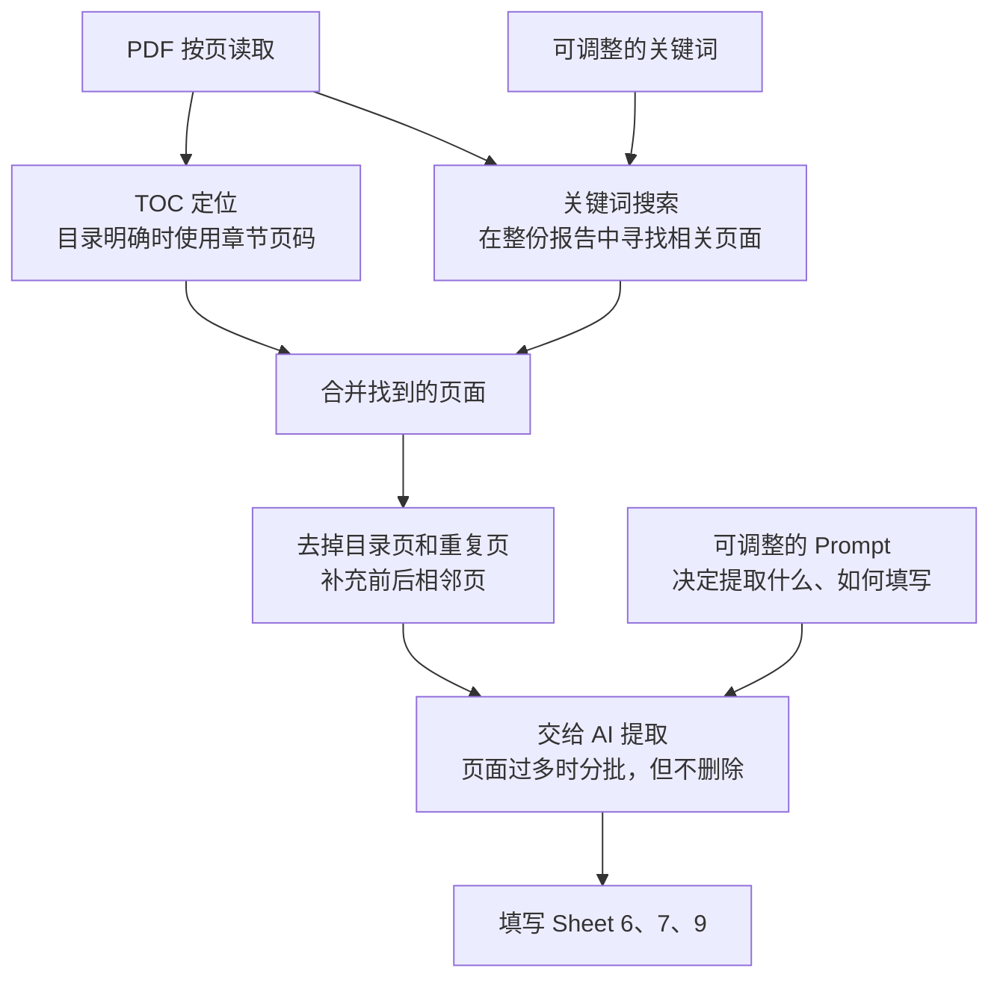

# SOC 107 Analyzer

FastAPI + React application for parsing SOC 1 reports and filling EY Form 107-A templates.

The project supports two modes:

- Development: Vite and FastAPI run separately.
- Windows desktop: React, FastAPI, prompts, search terms, Python dependencies, and the legacy `.env` API configuration are bundled into `SOC-Audit.exe`.

The Windows desktop build still needs network/VPN access to the configured API. Bundling an API key inside an executable does not encrypt the embedded key; use an authenticated company API gateway for broad production distribution.

## Development setup

### Prerequisites

- Python `3.12`
- Node.js `22.x` recommended
- npm

### Backend

Create and activate the Python environment, then install dependencies:

```bash
conda create -n soc-audit python=3.12
conda activate soc-audit
pip install -r backend/requirements.txt
```

Create `backend/.env`. On Windows PowerShell:

```powershell
New-Item backend/.env -ItemType File -Force
```

On macOS/Linux:

```bash
touch backend/.env
```

Existing LLM values in `backend/.env` are imported into the in-app API Library once after upgrading. They are retained for migration and desktop packaging compatibility:

```env
LLM_PROVIDER=dify
DIFY_BASE_URL=https://your-dify-server/v1
DIFY_API_KEY=your_api_key_here
DIFY_USER=soc-audit-local
```

Start the backend from the project root:

```bash
python run.py
```

The API is available at `http://127.0.0.1:8000`; its health endpoint is `http://127.0.0.1:8000/health`.

### Frontend

Install dependencies and start Vite:

```bash
cd frontend
npm install
npm run dev
```

The frontend is available at `http://localhost:3000`.

Do not copy `node_modules` between macOS and Windows. Install it separately on each operating system so npm selects the correct native optional packages.

## Normal usage

1. Start the backend and frontend.
2. Open **APIs**, add an LLM connection, then test and activate it.
3. Upload or select a Form 107-A template.
4. Upload or select parsed SOC reports.
5. Select the sheets to fill.
6. Run the job and download the output workbook.

## API Library

- Supported protocols: Dify Chatflow and OpenAI-compatible Chat Completions.
- Base URL and API key are the only required user inputs. The application detects the protocol/provider and attempts to select an accessible chat model automatically.
- A model ID can be entered under Advanced settings if the endpoint does not support model discovery.
- API keys are encrypted under `backend/storage/api_configs/` during development and `%LOCALAPPDATA%\SOC-Audit\storage\api_configs` in the packaged application. They are never returned to the browser.
- Back up `master.key` together with `api_configs.json`; neither file is useful on its own.
- A configuration must pass a connection test before activation. Each new job locks an immutable snapshot of the active connection.

## Sheet 6, 7 and 9 Search Terms

Page retrieval for Sheets 6, 7 and 9 is configured in `backend/app/search_terms/`.
Each UTF-8 JSON file contains one `keywords` list for each search topic. The
same keywords are used for both direct page matching and BM25 search. The files
are validated and reloaded at the start of every analysis job, so changes apply
to the next job without restarting the backend.



Leave `version` unchanged and edit only the `keywords` arrays. Invalid files fail the job with the filename and validation error instead of silently falling back to hard-coded terms.

Sheet 8 deliberately retains the dedicated CUEC section logic used before commit
`9ef0a14`. It scans for the original exact CUEC/customer-responsibility headings
or table signature, reads consecutive pages until the next known section, and
falls back to the TOC range if no section start is found. Sheet 8 does not use
BM25; Sheets 6, 7, and 9 continue to use the shared full-report BM25 index.

## Test desktop mode on macOS

This validates the desktop application flow but does not create a Windows executable:

```bash
pip install -r requirements-desktop.txt
npm --prefix frontend ci
npm --prefix frontend run build
python desktop.py
```

The generated `frontend/dist/` directory is ignored by Git and must be rebuilt on Windows.

## Build the Windows executable

PyInstaller must run on Windows to produce the Windows executable. Use Windows 10/11 x64 with:

- Python `3.12` x64
- Node.js `22.x` x64
- Microsoft Edge WebView2 Runtime
- Git

Clone or update the repository and switch to `exe`. Activate a Python 3.12 environment, then create the local API configuration:

```powershell
Copy-Item backend\.env.example backend\.env
notepad backend\.env
```

The embedded legacy configuration is imported into the encrypted API Library on first launch.

### Debug build

Build a one-directory executable with a visible console first:

```powershell
.\build_windows.ps1 -DebugBuild
.\dist\SOC-Audit\SOC-Audit.exe
```

The debug executable depends on the other files in `dist\SOC-Audit\` and cannot be distributed by itself.

### Release build

After the debug build passes:

```powershell
.\build_windows.ps1
```

If PowerShell blocks the script:

```powershell
powershell -ExecutionPolicy Bypass -File .\build_windows.ps1
```

The single distributable file is:

```text
dist\SOC-Audit.exe
```

The React build and PyInstaller work files are created under the Windows `%TEMP%` directory instead of the repository. This avoids common OneDrive or antivirus locks on `frontend\node_modules` and `build\SOC-Audit\localpycs`. The build script stops on a non-zero pip, npm, or PyInstaller exit code and verifies the expected executable before reporting success.

Users do not need Python or Node.js. They need WebView2 Runtime and network/VPN access to the configured API.

## Desktop storage and logs

The packaged application stores persistent files outside PyInstaller's temporary extraction directory:

```text
%LOCALAPPDATA%\SOC-Audit\storage
%LOCALAPPDATA%\SOC-Audit\soc-audit.log
```

Storage includes uploaded PDFs, parsed JSON, jobs, templates, encrypted API configurations, and output workbooks.

## Release checklist

Test the release executable on a clean Windows computer without Python or Node.js:

1. Open and close the application.
2. Navigate to APIs, Jobs, Reports, and Templates.
3. Confirm the embedded API configuration is imported, tested, and activated, or configure one through APIs.
4. Upload an `.xlsx` template and a PDF report.
5. Complete an API-backed extraction.
6. Generate the workbook, click Download, choose a location in the native Save As dialog, and verify the saved file.
7. Restart the application and confirm previous data remains available.
8. Check Windows Defender and SmartScreen behavior.
9. Code-sign the final executable before broad distribution.

## Development notes

- Development data is stored under `backend/storage/`.
- Packaged Windows data is stored under `%LOCALAPPDATA%\SOC-Audit\storage`.
- `backend/storage/`, `backend/.env`, `frontend/dist/`, and PyInstaller outputs are ignored by Git.
- If PDF parsing changes, re-upload and parse reports.
- If only prompts, search terms, or extraction logic change, existing parsed reports can be reused.
