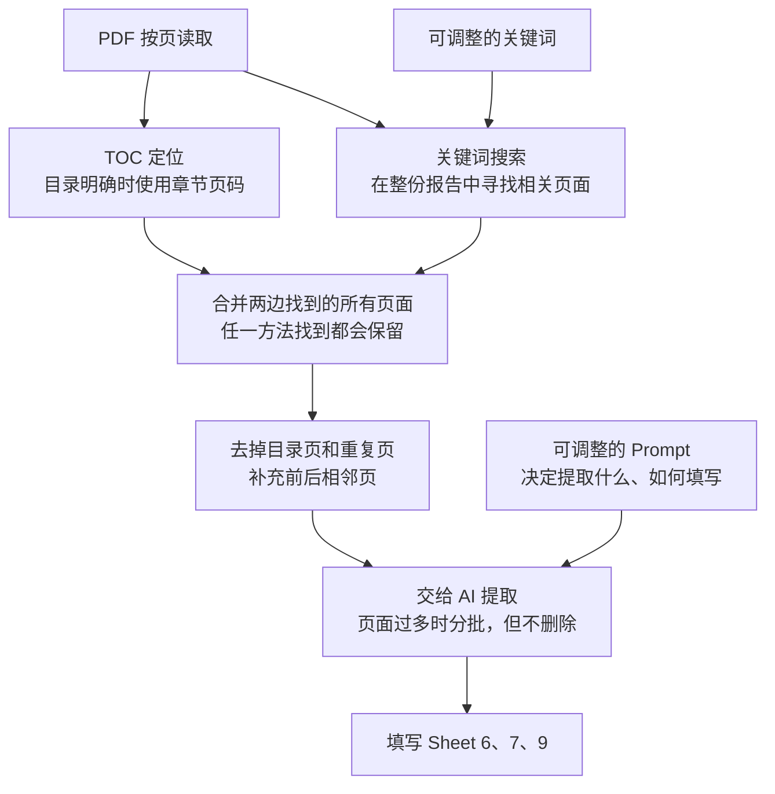

# SOC 107 Analyzer

FastAPI + React app for parsing SOC 1 reports and filling EY Form 107-A templates.

## Prerequisites

- Conda / Miniconda
- Node.js `22.x` recommended
- npm

## 1. Clone / Open Project

Open a terminal in the cloned `SOC-audit` project directory.

## 2. Backend Setup

Create and activate Python environment:

```bash
conda create -n soc-audit python=3.12
conda activate soc-audit
```

Install backend dependencies:

```bash
pip install -r backend/requirements.txt
```

Create backend environment file:

Create an empty `backend/.env` file. On Windows PowerShell:

```powershell
New-Item backend/.env -ItemType File -Force
```

On macOS/Linux:

```bash
touch backend/.env
```

Existing LLM values in `backend/.env` are imported into the in-app API Library
once after upgrading. They are kept for migration compatibility:

```env
BAILIAN_API_KEY=your_api_key_here
BAILIAN_BASE_URL=https://maas-coding-api.cn-huabei-1.xf-yun.com/v2
BAILIAN_MODEL=astron-code-latest
```

Start backend from project root:

```bash
python run.py
```

The launcher resolves paths from `run.py`, so it also works when the project is
stored in a Windows or OneDrive directory containing spaces.

Backend runs at:

```text
http://127.0.0.1:8000
```

Health check:

```text
http://127.0.0.1:8000/health
```

## 3. Frontend Setup

Use Node.js `22.x`. If using `nvm` on macOS/Linux:

```bash
nvm install 22
nvm use 22
```

Install frontend dependencies:

```bash
cd frontend
npm install
```

On Windows, install Node.js 22 and run the same `npm install` command from the
`frontend` directory. Do not copy `node_modules` from macOS/Linux; npm installs
the correct Windows-native optional packages automatically.

Start frontend:

```bash
npm run dev
```

Frontend runs at:

```text
http://localhost:5173
```

## 4. Normal Usage

1. Start backend: `python run.py`
2. Start frontend: `cd frontend && npm run dev`
3. Open `http://localhost:5173`
4. Open **APIs**, add an LLM connection, then test and activate it
5. Upload or select a Form 107-A template
6. Upload or select parsed SOC reports
7. Select sheets to fill
8. Run job and download output Excel

## API Library

- Supported protocols: Dify Chatflow and OpenAI-compatible Chat Completions.
- Base URL and API key are the only required user inputs. The app detects the
  protocol/provider and attempts to select an accessible chat model automatically.
- A model ID can be entered under Advanced settings if the endpoint does not
  support model discovery. Always use the exact Base URL supplied by the API
  service; Bailian endpoints can vary by region and workspace.
- API keys are encrypted under `backend/storage/api_configs/` and are never
  returned to the browser. Back up `master.key` together with
  `api_configs.json`; neither file is useful on its own.
- A configuration must pass a connection test before activation. Each new job
  locks an immutable snapshot of the active connection, so later switching or
  editing does not affect a running job.

## Sheet 6, 7 and 9 Search Terms

Page retrieval for Sheets 6, 7 and 9 is configured in `backend/app/search_terms/`.
Each UTF-8 JSON file contains one `keywords` list for each search topic. The
same keywords are used for both direct page matching and BM25 search. The files
are validated and reloaded at the start of every analysis job, so changes apply
to the next job without restarting the backend.



TOC positioning and keyword search run in parallel. The system keeps the union
of pages found by either method, so one method can recover pages missed by the
other.

- Put section titles, responsibility phrases, control-code prefixes, synonyms,
  and Chinese/English variants together in the topic's `keywords` list.
- Every keyword is searched literally and also submitted as an independent
  BM25 query. All matching pages are combined with the TOC pages.
- BM25 Top K and adjacent-page expansion are controlled by the application, so
  users only need to maintain keywords.
- To limit broad BM25 results, a multi-word keyword must match at least 75% of
  its distinct terms (and at least two terms), and each keyword contributes at
  most three BM25 pages. Direct literal matches are still always retained.
- BM25 is implemented inside the backend with the Python standard library; no
  separate `rank-bm25` or NumPy installation is required on Windows.

Leave `version` unchanged and edit only the `keywords` arrays. Invalid files
fail the job with the filename and validation error instead of silently falling
back to hard-coded terms.

Sheet 8 deliberately retains the dedicated CUEC section logic used before commit
`9ef0a14`. It scans for the original exact CUEC/customer-responsibility headings
or table signature, reads consecutive pages until the next known section, and
falls back to the TOC range if no section start is found. Sheet 8 does not use
BM25; Sheets 6, 7, and 9 continue to use the shared full-report BM25 index.

## Notes

- Uploaded PDFs, parsed JSON, jobs, and output Excel files are stored under `backend/storage/`.
- API configuration metadata, encrypted credentials, and the local encryption
  key are stored under `backend/storage/api_configs/` and ignored by git.
- `backend/storage/` and `backend/.env` are ignored by git.
- If PDF parsing logic changes, re-upload/re-parse reports.
- If only prompts or extraction logic changes, existing parsed reports can be reused.
